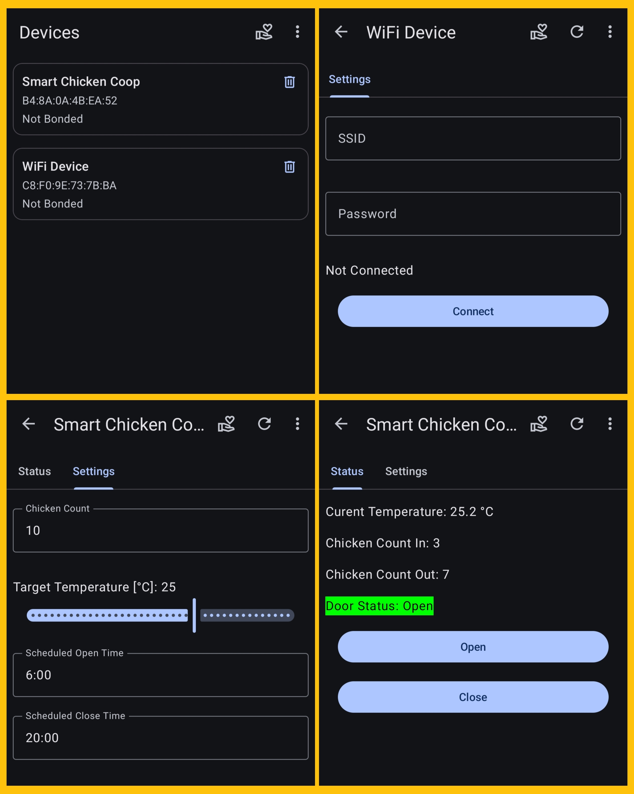
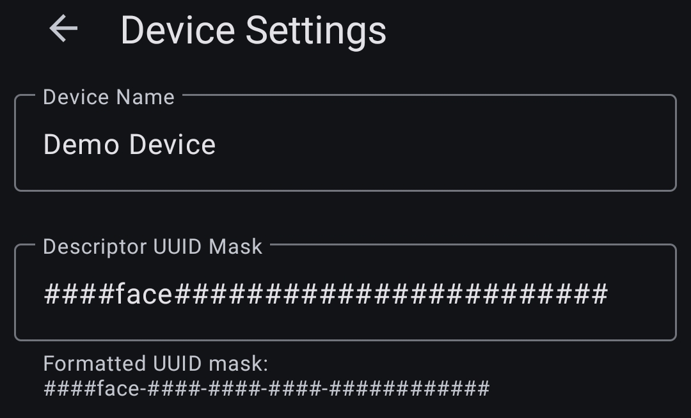
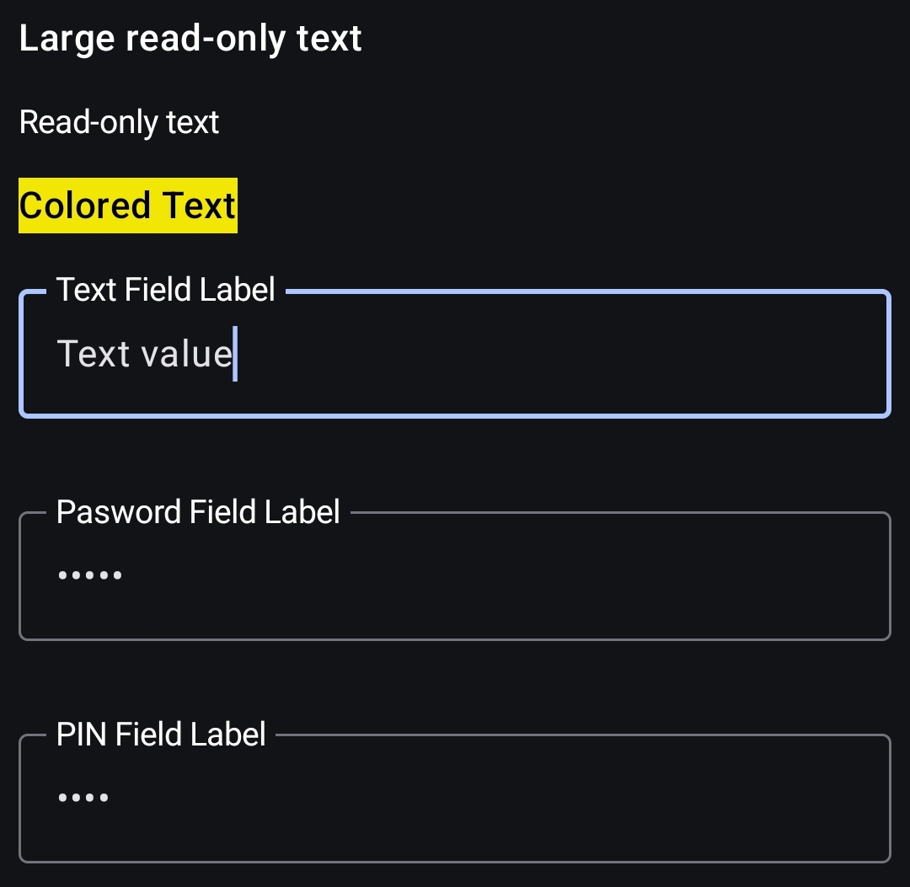
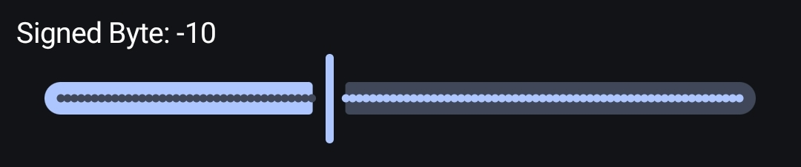
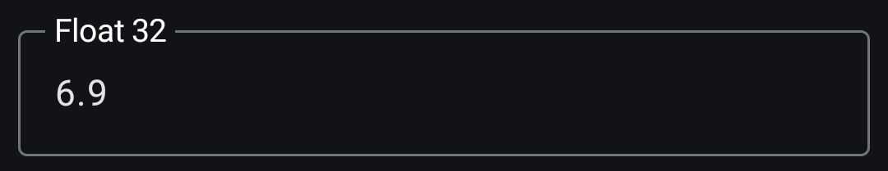
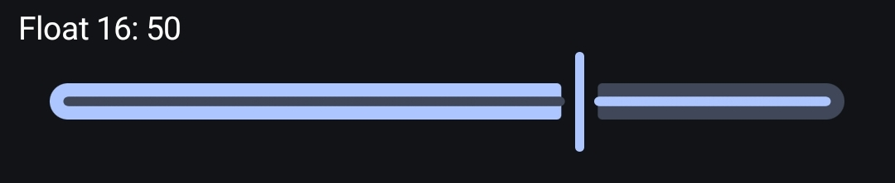
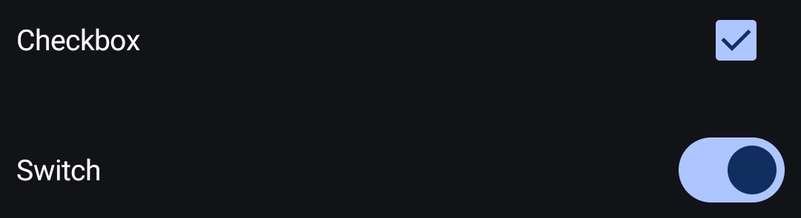
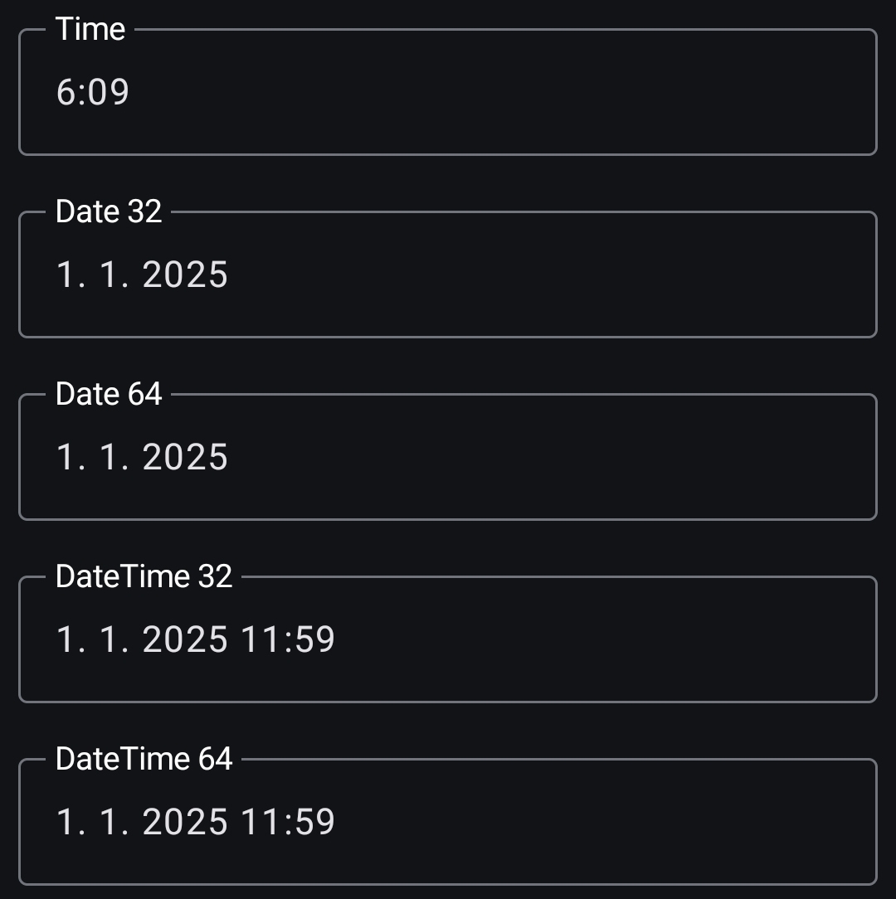
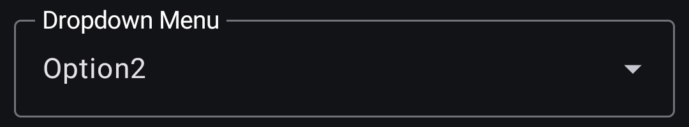
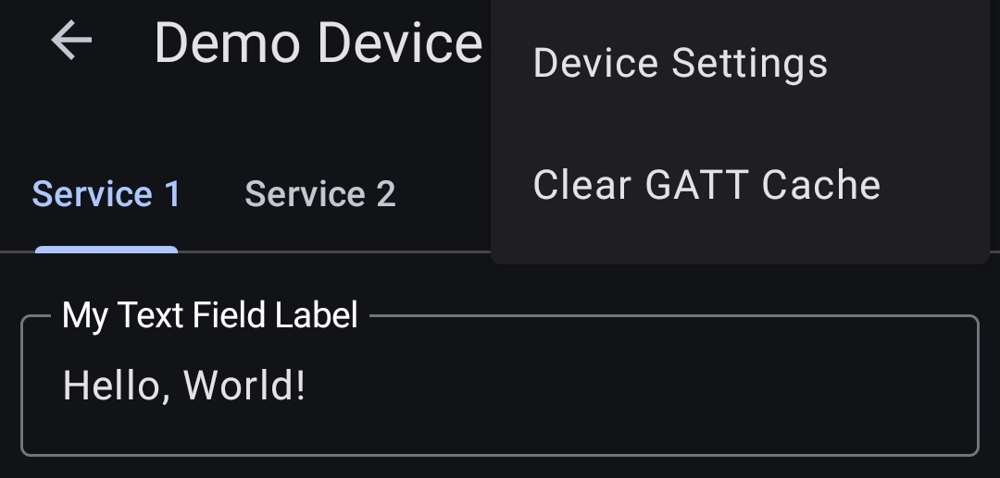

***The application will be publicly available soon. To get early access to the app, you need to first join the Google Group [https://groups.google.com/g/blemanager](https://groups.google.com/g/blemanager) and then sign up for closed testing here [https://play.google.com/apps/testing/net.satka.bleManager](https://play.google.com/apps/testing/net.satka.bleManager).***

# BLE Manager

The BLE Manager application for Android makes it easy to manage the characteristics of your device. **No additional libraries** are required to use the app with your device. **Simply annotate the characteristic with a descriptor** specifying the data type, the desired graphical component, and additional properties such as minimum and maximum values. **That's it!** Once the application connects to your device, the described characteristic will appear in the app, allowing you to **read** and **set** its value. All components also support notifications and indications from the device.

## Basic Concepts

### Service

This is a term from the BLE specification. A service provides characteristics, and each service can contain multiple characteristics. In the application, each service is displayed as a tab.

### Characteristic

Characteristics are values provided by a service. They are byte arrays that must be interpreted by the client (application).

### Descriptor

A descriptor's value describes a characteristic. Standard descriptor types exist, but for BLE Manager, a custom descriptor is required to tell BLE Manager how to interpret the value and which UI component to use for display. The BLE Manager application uses JSON format for descriptor values.

### Descriptor UUID Mask

To uniquely identify the correct *custom descriptor* among potentially many descriptors associated with a characteristic, the BLE Manager application uses a *descriptor UUID mask*. This mask acts as a filter, allowing the application to quickly locate the specific descriptor it needs.

The mask is configured individually for each connected device and can contain hexadecimal digits (0-9, A-F) and the `#` character. The `#` character serves as a wildcard, meaning it can represent any hexadecimal digit (0-9, A-F) in the descriptor UUID.

The default mask for each newly added device is: `####face-####-####-####-############`. This mask indicates that the middle part of the UUID must be `face`, while the surrounding parts can be any hexadecimal digits.

For example, the UUID `2000face-74ee-43ce-86b2-0dde20dcefd6` matches this default mask because it contains `face` in the correct position.

In more advanced scenarios, different masks can be used to achieve more complex filtering or to handle different interpretations of the characteristic's value based on which descriptor is matched. This allows for flexibility in handling various device configurations and data formats.

## What do you need to do to use your device with the BLE Manager application?

 To make your Bluetooth Low Energy (BLE) device compatible with the BLE Manager application and display its characteristics correctly, you need to: 
 
 - **Configure a custom descriptor for each characteristic you want to manage.**
 
 This is the only required step on the device side. This example shows how to create a custom descriptor that will display the associated characteristic as a editable text field within the BLE Manager application.
 
 Here is an example of how to create a custom descriptor in the Arduino Framework. `BLEDescriptor` class is a part of the Arduino Framework. For BLE Manager, we only set the JSON value.

	BLEDescriptor *textDescriptor = new BLEDescriptor(CUSTOM_DESCRIPTOR_UUID, 200);
	textDescriptor->setValue(
		R"({"type":"text", "order":1, "disabled":false, "label":"My Text Field Label", "maxBytes": 80})"
	);
	pCharacteristicText->addDescriptor(textDescriptor);

## Guide

#### Examples

- [Examples](https://github.com/petrsatka/BLEManager/tree/main/Examples)

This guide references examples primarily for the ESP32 microcontroller. However, it's important to understand that the BLE Manager application is designed to be versatile and can be used with any Bluetooth Low Energy (BLE) device, regardless of its underlying hardware or firmware.

While the code examples will demonstrate how to set up custom descriptors on an ESP32, the core concept of using custom descriptors to define how characteristics are displayed and handled in the BLE Manager remains the same for all BLE devices.

The key takeaway is that you only need to ensure your BLE device (whatever it may be) correctly implements the custom descriptors as described in this guide. The BLE Manager application will then be able to interpret the characteristics accordingly.

Therefore, although the examples focus on ESP32, the information provided is applicable to any device that conforms to the BLE specification and correctly implements custom descriptors.

### Naming a Service

#### Examples

- [HelloWorld.ino](Examples/ESP32/ArduinoIDE/HelloWorld/HelloWorld/HelloWorld.ino)
- [MultipleServices.ino](Examples/ESP32/ArduinoIDE/HelloWorld/MultipleServices/MultipleServices.ino)

In order for the BLE Manager application to display a user-friendly, human-readable name for a given service, that service must expose a specific characteristic. The *value* of this characteristic will then be used as the service's displayed name within the application.

To tell the BLE Manager application that a particular characteristic should be used for this purpose, we associate a *descriptor* with that characteristic. This descriptor has two key properties:

1.  **UUID Matching a Mask:** The descriptor's UUID must conform to a predefined mask, ensuring the application can identify it as the "service name" descriptor.
2.  **JSON Value:** The descriptor's value is a JSON string containing specific instructions.

A typical example of this JSON value is: `{"type":"serviceName", "order":1}`

**Explanation of the JSON properties:**

*   `"type":"serviceName"`: This is the crucial property. It explicitly tells the BLE Manager application that the *value* of the associated characteristic should be interpreted and displayed as the name of the service.
*   `"order":1`: This property determines the order in which this service (and its associated characteristics) are displayed within the application's user interface. A lower number means it will be displayed earlier in the list. This allows you to control the presentation of multiple services.

**In summary:** By adding a descriptor with a UUID that matches the correct mask and the JSON value `{"type":"serviceName", "order":1}` to a characteristic, you effectively designate that characteristic as the source of the service's display name in the BLE Manager application. The actual name of the service will be the *value* of this characteristic (e.g., if the characteristic's value is "Service 1", that's what will be displayed in the app).

### Describing a Characteristic

#### Examples

- [HelloWorld.ino](Examples/ESP32/ArduinoIDE/HelloWorld/HelloWorld/HelloWorld.ino)

Let's say your BLE device has a characteristic that holds a text value, and you want this value to be displayed and edited in the BLE Manager application. You achieve this by adding a *descriptor* to that characteristic with a specific JSON configuration.

Here's an example of such a JSON configuration:

    {"type":"text", "order":1, "disabled":false, "label":"Text Field Label", "maxBytes": 80}

**Explanation of the JSON properties:**

*   `"type":"text"`: This property tells the BLE Manager application that the characteristic's value should be treated as text and displayed as a text field.
*   `"order":1`: This defines the display order of this characteristic relative to other characteristics of the same service. Lower numbers appear first.
*   `"disabled":false`: This property controls whether the text field is editable in the application. Setting it to `false` *intends* to enable editing. However, there's an important caveat:
    *   **Characteristic's Write Property Override:** The editability is ultimately determined by the characteristic's inherent properties. If the characteristic itself *does not* have the "write" permission enabled (meaning it's a read-only characteristic), then setting `"disabled":false` in the descriptor will have *no effect*. The text field will still be displayed as read-only.
*   `"label":"Text Field Label"`: This sets the label that will be displayed next to the text field in the application, providing context for the user.
*   `"maxBytes": 80`: This sets the maximum number of bytes that can be written to the characteristic through the text field in the application. This helps prevent buffer overflows and ensures data integrity.

**Example scenario:**

If the characteristic's value is "Hello World!" and the above descriptor is applied, the BLE Manager app will display a text field labeled "My Text Field Label" containing "Hello World!". If the characteristic is writable, the user can edit the text within the 80-byte limit. If the characteristic is read-only, the user will only be able to view the text.

**Key takeaway:** The descriptor provides instructions to the BLE Manager application on how to present the characteristic's data. However, the characteristic's fundamental properties (like writability) always take precedence.

### Advanced Scenario

#### Examples

- [MultipleMasks.ino](Examples/ESP32/ArduinoIDE/Advanced/MultipleMasks/MultipleMasks.ino)

You can safely skip this paragraph for now and return to it once you've tried the basic functions.

Imagine a situation where you have a thermostat with a Wi-Fi connection. You want most household members to be able to adjust the temperature within a certain range, but you want to have the ability to also configure the Wi-Fi connection and occasionally heat the place up a bit more :-). You can achieve this by creating two descriptors with UUIDs matching different masks. For example, `####fBce-####-####-####-############` and `####fAce-####-####-####-############`.

Using a descriptor with a UUID matching the first mask (`####fBce-####-####-####-############`), you describe all the device's properties, and you set this mask in *your* application. Using a descriptor with a UUID matching the second mask (`####fAce-####-####-####-############`), you describe *only* the temperature setting characteristic, and the descriptor's value can define different limits for this characteristic. You would set this second mask in the applications of other household members, or you don't have to set anything if you use the default mask for these purposes.

**Explanation and Key Takeaways:**

This scenario demonstrates a powerful feature: using different descriptors (identified by distinct UUIDs based on different masks) to provide different levels of access and control to the same BLE device.

*   **Mask 1 (`####fBce-####-####-####-############`): Full Control:** This mask is used in *your* application to expose all functionalities of the thermostat, including Wi-Fi configuration and wider temperature control. The descriptor associated with a UUID matching this mask would contain JSON describing all characteristics and their full capabilities.

*   **Mask 2 (default) (`####fAce-####-####-####-############`): Limited Control:** This mask is used in other household members' applications. The descriptor associated with a UUID matching this mask *only* describes the temperature setting characteristic and might include specific limits (e.g., a narrower temperature range).

**Benefits:**

*   **Granular Access Control:** You can precisely control which features are accessible to different users.
*   **Simplified User Interface:** Other users' apps can have a simpler UI that only shows the essential temperature controls.
*   **Security:** By limiting access, you prevent accidental or unauthorized changes to critical settings like Wi-Fi configuration.

## Descriptor Values

Descriptor values determine how characteristic values are interpreted and which graphical component is used for display. In BLE communication, the Little Endian format is typically used for interpreting characteristic values. However, all components interpreting multi-byte numbers also exist in a Big Endian variant. All components support notifications/indications from the device. If you are using notifications/indications, it may be necessary to enable MTU (Maximum Transmission Unit) negotiation in the application. The default MTU is 23 bytes. Notifications/Indications allow sending data of size MTU - 3. The "Negotiate Maximum MTU" setting allows, depending on the device, using an MTU of up to 517 bytes.

#### Example

- [Indications.ino](Examples/ESP32/ArduinoIDE/HelloWorld/Indications/Indications.ino)

Descriptor values are in JSON format. Parsing is relatively lenient, however, property keys are *case-sensitive*. If a component has the option to limit the maximum and minimum values, the default setting corresponds to the maximum and minimum value of the given data type. For text, the default maximum value is 512 bytes. Every descriptor value contains the `order` property. `order` determines the display order in the application. If `order` is not set, the order is determined by the UUID value. Below are examples of individual settings with a description of their behavior.

**Detailed Explanation:**

*   **JSON Format and Case Sensitivity:** Descriptor configurations are defined using JSON. While the parser is tolerant to some variations in formatting, it's crucial to remember that property keys (like `"type"`, `"order"`, `"minInt"`, `"maxInt"`, etc.) are case-sensitive. `"Type"` or `"ORDER"` will not be recognized.

*   **Default Min/Max Values:** For components that support minimum and maximum value constraints (e.g., numeric types), the default values are set to the natural minimum and maximum limits of the underlying data type. For example, if you're using a 16-bit integer, the default `min` would be -32768 and the default `max` would be 32767.

*   **Default Max Length for Text:** For text fields, if you don't specify a `"maxBytes"` property, the default maximum length is 512 bytes.

*   **`order` Property:** The `order` property is crucial for controlling the display order of characteristics and their associated descriptors within the application's user interface. It's an integer value. Lower numbers are displayed first.

### List of Possible Descriptor Values

### *Tab Headers*

#### Examples

- [HelloWorld.ino](Examples/ESP32/ArduinoIDE/HelloWorld/HelloWorld/HelloWorld.ino)
- [MultipleServices.ino](Examples/ESP32/ArduinoIDE/HelloWorld/MultipleServices/MultipleServices.ino)

#### Service Name

    {"type":"serviceName", "order":1}

A descriptor with this value marks a characteristic whose value will be interpreted as text and used for the *tab name* in the application. Each service can contain one such described characteristic.

**Detailed Explanation:**

This section describes how to define the name of a tab in the application, which represents a BLE service. This is achieved by adding a specific descriptor to a characteristic within that service.

*   **JSON Configuration:** The descriptor's configuration is defined using a JSON object: `{"type":"serviceName", "order":1}`

*   **`"type":"serviceName"`:** This is the key property. It tells the application that the *value* of the associated characteristic should be used as the name for the tab representing the service.

*   **`"order":1`:** This property determines the order in which the tabs are displayed in the application's user interface. Lower numbers are displayed first.

**Example:**

Let's say a BLE service has a characteristic with the value "Heart Rate Monitor". If that characteristic has a descriptor configured as `{"type":"serviceName", "order":1}`, then the application will create a tab labeled "Heart Rate Monitor".

**Why this is important:**

This mechanism provides a user-friendly way to label and organize different BLE services within the application's interface. Instead of displaying cryptic UUIDs, users see descriptive names for each service, making it easier to interact with the device.

### *Texts*

#### Examples

- [Texts.ino](Examples/ESP32/ArduinoIDE/AllControls/Texts/Texts.ino)

*All text values are encoded using UTF-8*

#### Text View

    {"type":"textView", "order":1, "disabled":false}

The value of a characteristic described in this way will be interpreted as text and displayed for reading only.

#### Title

    {"type":"titleView", "order":1, "disabled":false}

The value of a characteristic described in this way will be interpreted as text and displayed in a larger font for reading only.

#### Rich Text View

    {"type":"richTextView", "order":1, "disabled":false}

The value of this characteristic will be interpreted as JSON-formatted text and displayed for reading only.

    {"text":"Colored Text", "color":"#000000", "background":"#F2E605", "title":true}

The characteristic's value can have these properties:

*   **text:** The displayed text.
*   **color:** The text color. Possible formats: `#RRGGBB` or `#AARRGGBB`.
*   **background:** The text background color.
*   **title:** If `true`, a larger font will be used.

#### Text

    {"type":"text", "order":1, "disabled":false, "label":"Text Field Label", "maxBytes": 30}

Editable text field. `maxBytes` allows limiting the maximum number of _bytes_ entered (not the number of characters). The maximum that can be entered is 512 bytes.

#### Password

    {"type":"password", "order":1, "disabled":false, label:"Pasword Field Label", "maxBytes": 30}

Editable text field for entering a password. `maxBytes` allows limiting the maximum number of bytes entered (not the number of characters). The maximum that can be entered is 512 bytes.

#### PIN

    {"type":"pin", "order":1, "disabled":false, label:"PIN Field Label", "maxBytes": 30}

Editable text field for entering a numerical password (PIN). `maxBytes` allows limiting the maximum number of bytes entered (not the number of characters). The maximum that can be entered is 512 bytes.

### *Signed Integers*

#### Examples

- [SignedIntegers.ino](Examples/ESP32/ArduinoIDE/AllControls/SignedIntegers/SignedIntegers.ino)

#### SInt8

    {"type":"sint8", "order":1, "disabled":false, "label":"Signed Byte", "minInt":-100, "maxInt":100}
    
Editable field for 8-bit signed integer

#### SInt16

    {"type":"sint16", "order":1, "disabled":false, "label":"Signed Int16", "minInt":-100, "maxInt":100}

Editable field for 16-bit signed integer

#### SInt32

    {"type":"sint32", "order":1, "disabled":false, "label":"Signed Int32", "minInt":-100, "maxInt":100}

Editable field for 32-bit signed integer

#### SInt64

    {"type":"sint64", "order":1, "disabled":false, "label":"Signed Int64", "minInt":-100, "maxInt":100}

Editable field for 64-bit signed integer

### *Signed Integer Sliders*

#### Examples

- [SignedIntegerSliders.ino](Examples/ESP32/ArduinoIDE/AllControls/SignedIntegerSliders/SignedIntegerSliders.ino)

#### SInt8Slider

    {"type":"sint8slider", "order":1, "disabled":false, "label":"Signed Byte", "minInt":-50, "maxInt":50, "stepInt":1}

Slider for setting an 8-bit signed integer. The `stepInt` property determines the step size.

#### SInt16Slider

    {"type":"sint16slider", "order":1, "disabled":false, "label":"Signed Int16", "minInt":-50, "maxInt":50, "stepInt":1}

Slider for setting an 16-bit signed integer. The `stepInt` property determines the step size.

### *Unsigned Integers*

#### Examples

- [UnsignedIntegers.ino](Examples/ESP32/ArduinoIDE/AllControls/UnsignedIntegers/UnsignedIntegers.ino)

#### UInt8

    {"type":"uint8", "order":1, "disabled":false, "label":"Unsigned Byte", "minInt":0, "maxInt":100}

Editable field for an 8-bit unsigned integer

#### UInt16

    {"type":"uint16", "order":1, "disabled":false, "label":"Unsigned Int16", "minInt":0, "maxInt":100}

Editable field for an 16-bit unsigned integer

#### UInt32

    {"type":"uint32", "order":1, "disabled":false, "label":"Unsigned Int32", "minInt":0, "maxInt":100}

Editable field for an 32-bit unsigned integer

#### UInt64

    {"type":"uint64", "order":1, "disabled":false, "label":"Unsigned Int64", "minInt":0, "maxInt":100}

Editable field for an 64-bit unsigned integer

### *Unsigned Integer Sliders*

#### Examples

- [UnsignedIntegerSliders.ino](Examples/ESP32/ArduinoIDE/AllControls/UnsignedIntegerSliders/UnsignedIntegerSliders.ino)

#### UInt8Slider

    {"type":"uint8slider", "order":1, "disabled":false, "label":"Unsigned Byte", "minInt":0, "maxInt":100, "stepInt":1}

Slider for setting an 8-bit unsigned integer. The `stepInt` property determines the step size.

#### UInt16Slider

    {"type":"uint16slider", "order":1, "disabled":false, "label":"Unsigned Int16", "minInt":0, "maxInt":100, "stepInt":1}

Slider for setting an 16-bit unsigned integer. The `stepInt` property determines the step size.

### *Floats*

#### Examples

- [Floats.ino](Examples/ESP32/ArduinoIDE/AllControls/Floats/Floats.ino)

#### Half

    {"type":"half", "order":1, "disabled":false, "label":"Float 16", "minFloat": -100, "maxFloat": 100}

Editable field for a 16-bit float

#### Float

    {"type":"float", "order":1, "disabled":false, label:"Float 32", "minFloat": -100, "maxFloat": 100}

Editable field for a 32-bit float

#### Double

    {"type":"double", "order":1, "disabled":false, label:"Float 64", "minFloat": -100, "maxFloat": 100}

Editable field for a 64-bit float

### *Float Sliders*

#### Examples

- [FloatSliders.ino](Examples/ESP32/ArduinoIDE/AllControls/FloatSliders/FloatSliders.ino)

#### HalfSlider

    {"type":"halfslider", "order":1, "disabled":false, "label":"Float 16", "minFloat": -50, "maxFloat": 50, "stepFloat": 0.1}

Slider for setting a 16-bit float value. The `stepFloat` property determines the step size.

#### FloatSlider

    {"type":"floatslider", "order":1, "disabled":false, label:"Float 32", "minFloat": -50, "maxFloat": 50, "stepFloat": 0.1}

Slider for setting a 32-bit float value. The `stepFloat` property determines the step size.

### *Booleans*

#### Examples

- [Booleans.ino](Examples/ESP32/ArduinoIDE/AllControls/Booleans/Booleans.ino)

#### Check

    {"type":"check", "order":1, "disabled":false, label:"Checkbox"}

Checkbox for setting a boolean value of an 8-bit characteristic.
- Reads `0 = false, otherwise true`
- Writes `false = 0, true = 1`

#### Switch

    {"type":"switch", "order":1, "disabled":false, label:"Switch"}

Switch for setting a boolean value of an 8-bit characteristic.
- Reads `0 = false, otherwise true`
- Writes `false = 0, true = 1`

### *Actions*

#### Examples

- [Button.ino](Examples/ESP32/ArduinoIDE/AllControls/Button/Button.ino)

#### Button

    {"type":"button", "order":1, "disabled":false, "label":"Button"}

On each press, the value of an 8-bit unsigned integer is incremented by one. It starts at `0`.

### *Colors*

#### Examples

- [Color.ino](Examples/ESP32/ArduinoIDE/AllControls/Color/Color.ino)

#### Color

    {"type":"color", "order":1, "disabled":false, "label":"Color", "alphaSlider":true}

Colorpicker for color selection. Works with a 32-bit *ABGR* value, where *R* is stored in the 1st byte.
*For 0xFF05E6F2 is A:0xFF, B:0x05, G:0xE6, R:0xF2*
The `alphaSlider` property determines whether the alpha channel slider is displayed.

### *Date and Time*

#### Examples

- [DateAndTime.ino](Examples/ESP32/ArduinoIDE/AllControls/DateAndTime/DateAndTime.ino)

#### Time

    {"type":"time", "order":1, "disabled":false, "label":"Time"}

Allows setting time as a 32-bit unsigned integer. The value represents the number of seconds since midnight.

#### Date32

    {"type":"date32", "order":1, "disabled":false, "label":"Date 32"}

Allows setting a 32-bit date. The value represents the number of seconds since the beginning of the Unix epoch. The time is always `0:00`.

#### Date64

    {"type":"date64", "order":1, "disabled":false, "label":"Date 64"}

Allows setting a 64-bit date. The value represents the number of seconds since the beginning of the Unix epoch. The time is always `0:00`.

#### DateTime32

    {"type":"datetime32", "order":1, "disabled":false, "label":"DateTime 32"}

Allows setting a 32-bit date and time. The value represents the number of seconds since the beginning of the Unix epoch.

#### DateTime64

    {"type":"datetime64", "order":1, "disabled":false, "label":"DateTime 64"}

Allows setting a 64-bit date and time. The value represents the number of seconds since the beginning of the Unix epoch.

### *Selection from multiple options*

#### Examples

- [Dropdown.ino](Examples/ESP32/ArduinoIDE/AllControls/Dropdown/Dropdown.ino)

#### Dropdown

    {"type":"dropdown", "order":1, "disabled":false, label:"Dropdown Menu", "options":["Option1","Option2","Option3"]}

Allows selecting one of the text values from the options array.

### BigEndian component variants

8-bit variants may seem redundant, but they exist for consistent data interpretation. Each integer component can process an arbitrarily long value by truncating it to the required number of bytes.

### *Big Endian Signed Integers*

#### Examples

- [SignedIntegersBigEndian.ino](Examples/ESP32/ArduinoIDE/AllControls/BigEndian/SignedIntegersBigEndian/SignedIntegersBigEndian.ino)

#### SInt8Be

    {"type":"sint8be", "order":1, "disabled":false, "label":"Signed Byte", "minInt":-100, "maxInt":100}
    
#### SInt16Be

    {"type":"sint16be", "order":1, "disabled":false, "label":"Signed Int16", "minInt":-100, "maxInt":100}
    
#### SInt32Be

    {"type":"sint32be", "order":1, "disabled":false, "label":"Signed Int32", "minInt":-100, "maxInt":100}
    
#### SInt64Be

    {"type":"sint64be", "order":1, "disabled":false, "label":"Signed Int64", "minInt":-100, "maxInt":100}

### *Big Endian Signed Integer Sliders*

#### Examples

- [SignedIntegerSlidersBigEndian.ino](Examples/ESP32/ArduinoIDE/AllControls/BigEndian/SignedIntegerSlidersBigEndian/SignedIntegerSlidersBigEndian.ino)

#### SInt8SliderBe

    {"type":"sint8sliderbe", "order":1, "disabled":false, "label":"Signed Byte", "minInt":-50, "maxInt":50, "stepInt":1}
    
#### SInt16SliderBe

    {"type":"sint16sliderbe", "order":1, "disabled":false, "label":"Signed Int16", "minInt":-50, "maxInt":50, "stepInt":1}

### *Big Endian Unsigned Integers*

#### Examples

- [UnsignedIntegersBigEndian.ino](Examples/ESP32/ArduinoIDE/AllControls/BigEndian/UnsignedIntegersBigEndian/UnsignedIntegersBigEndian.ino)

#### UInt8Be

    {"type":"uint8be", "order":1, "disabled":false, "label":"Unsigned Byte", "minInt":0, "maxInt":100}
    
#### UInt16Be

    {"type":"uint16be", "order":1, "disabled":false, "label":"Unsigned Int16", "minInt":0, "maxInt":100}
    
#### UInt32Be

    {"type":"uint32be", "order":1, "disabled":false, "label":"Unsigned Int32", "minInt":0, "maxInt":100}
    
#### UInt64Be

    {"type":"uint64be", "order":1, "disabled":false, "label":"Unsigned Int64", "minInt":0, "maxInt":100}

### *Big Endian Unsigned Integer Sliders*

#### Examples

- [UnsignedIntegersBigEndian.ino](Examples/ESP32/ArduinoIDE/AllControls/BigEndian/UnsignedIntegerSlidersBigEndian/UnsignedIntegerSlidersBigEndian.ino)

#### UInt8SliderBe

    {"type":"uint8sliderbe", "order":1, "disabled":false, "label":"Unsigned Byte", "minInt":0, "maxInt":50, "stepInt":1}
    
#### UInt16SliderBe

    {"type":"uint16sliderbe", "order":1, "disabled":false, "label":"Unsigned Int16", "minInt":0, "maxInt":50, "stepInt":1}

### *Big Endian Floats*

#### Examples

- [FloatsBigEndian.ino](Examples/ESP32/ArduinoIDE/AllControls/BigEndian/FloatsBigEndian/FloatsBigEndian.ino)

#### HalfBe

    {"type":"halfbe", "order":1, "disabled":false, "label":"Float 16", "minFloat":-100, "maxFloat":100}
    
#### FloatBe

    {"type":"floatbe", "order":1, "disabled":false, label:"Float 32", "minFloat":-100, "maxFloat":100}
    
#### DoubleBe

    {"type":"doublebe", "order":1, "disabled":false, label:"Float 64", "minFloat":-100, "maxFloat":100}

### *Big Endian Float Sliders*

#### Examples

- [FloatSlidersBigEndian.ino](Examples/ESP32/ArduinoIDE/AllControls/BigEndian/FloatSlidersBigEndian/FloatSlidersBigEndian.ino)

#### HalfSliderBe

    {"type":"halfsliderbe", "order":1, "disabled":false, "label":"Float 16", "minFloat": -50, "maxFloat": 50, "stepFloat": 0.1}
    
#### FloatSliderBe

    {"type":"floatsliderbe", "order":1, "disabled":false, label:"Float 32", "minFloat": -50, "maxFloat": 50, "stepFloat": 0.1}

### *Big Endian Date and Time*

#### Examples

- [DateAndTimeBigEndian.ino](Examples/ESP32/ArduinoIDE/AllControls/BigEndian/DateAndTimeBigEndian/DateAndTimeBigEndian.ino)

#### TimeBe

    {"type":"timebe", "order":1, "disabled":false, "label":"Time"}
    
#### Date32Be

    {"type":"date32be", "order":1, "disabled":false, "label":"Date 32"}
    
#### Date64Be

    {"type":"date64be", "order":1, "disabled":false, "label":"Date 64"}
    
#### DateTime32Be

    {"type":"datetime32be", "order":1, "disabled":false, "label":"DateTime 32"}
    
#### DateTime64Be

    {"type":"datetime64be", "order":1, "disabled":false, "label":"DateTime 64"}

---

## FAQ

### The paired/bonded device is not functioning properly

Pairing/bonding is a process that takes place between your device and the Android system. The BLE manager does not interfere with this process in any way. Android **caches** information about services, characteristics, and descriptors for paired devices. After modifying your device's software, if you are using pairing, it is necessary to **unpair** and **re-pair** the device in Android. Alternatively, you can try clearing the cache directly from the BLE Manager app. *Clearing the cache calls an unofficial API and may not work correctly on all Android devices.* **It is best to enable pairing on the device only after development is complete.**

### What is descriptor 0x2902?

The Client Characteristic Configuration Descriptor (CCCD), identified by the UUID *0x2902*, enables a Bluetooth Low Energy (BLE) client to configure how it receives updates from a characteristic on a server. Specifically, it allows the client to request to receive *notifications* or *indications*. If a characteristic is designed to support notifications or indications (meaning the server can send asynchronous updates to the client), it *must* include this descriptor. Without the CCCD, the client has no mechanism to enable or disable these updates.

#### Example

- [Indications.ino](Examples/ESP32/ArduinoIDE/HelloWorld/Indications/Indications.ino)

### I don't see all the characteristics in the app

On ESP32, a service has 15 handles by default (identifiers for the service, characteristics, and descriptors). A characteristic needs 2 handles, a descriptor 1. To increase the number of handles, use a parameter when creating the service:

    BLEService *pService = pServer->createService(BLEUUID(SERVICE_UUID), 32); // 32 handles
    
This allows defining more elements in the service, but platform limitations must be considered.

### The ESP32 fails to boot after configuring a custom descriptor in the BLE service

The default length of a descriptor value in *ESP32* is limited to *100 bytes*. Exceeding this length leads to unauthorized memory access (memory corruption). You can increase the maximum descriptor value length in this way:

    BLEDescriptor *serviceNameDescriptor = new BLEDescriptor(CUSTOM_DESCRIPTOR_UUID, 200); // 200 bytes

### The notified/indicated data is truncated

According to the Bluetooth Low Energy (BLE) specification, the maximum size of data that can be sent in a single notification or indication is limited to the Maximum Transmission Unit (MTU) minus 3 bytes. The default MTU is 23 bytes, meaning that *by default, you can send a maximum of 20 bytes* of data in a single notification or indication. If you need to send larger amounts of data, you can **enable MTU negotiation** in application. By enabling MTU negotiation in the BLE Manager, the MTU can be increased up to 517 bytes.

### RichTextView is not working for the values received via notifications/indications
According to the Bluetooth Low Energy (BLE) specification, the maximum size of data that can be sent in a single notification or indication is limited to the Maximum Transmission Unit (MTU) minus 3 bytes. The default MTU is 23 bytes, meaning that *by default, you can send a maximum of 20 bytes* of data in a single notification or indication. If you need to send larger amounts of data, you can **enable MTU negotiation** in application. By enabling MTU negotiation in the BLE Manager, the MTU can be increased up to 517 bytes.

---

[Privacy Policy](Privacy_policy.md)
